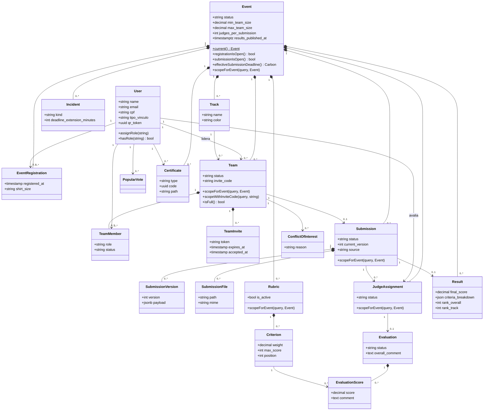
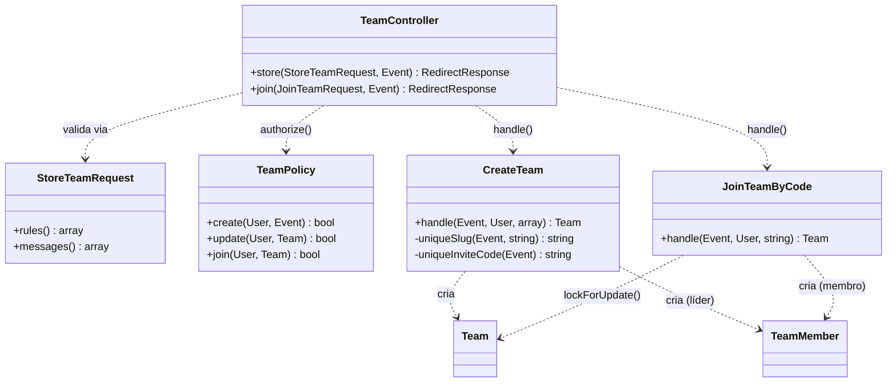
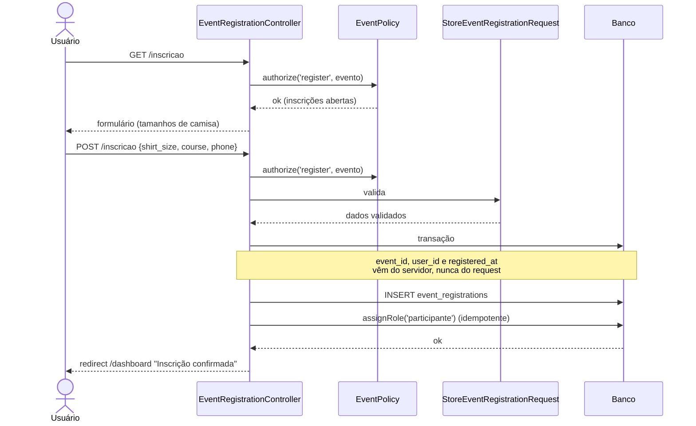
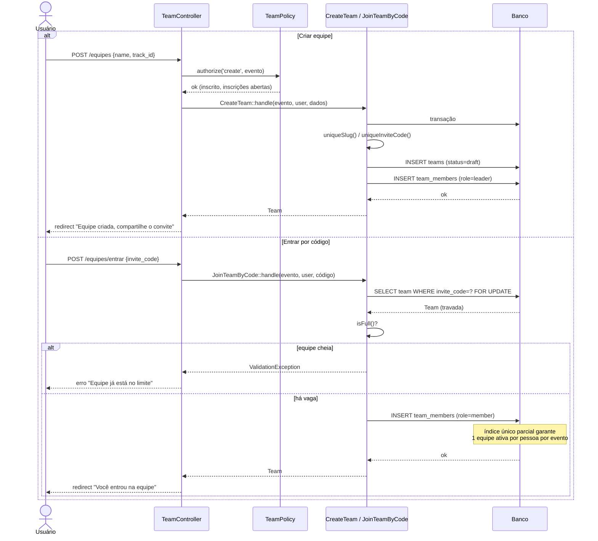
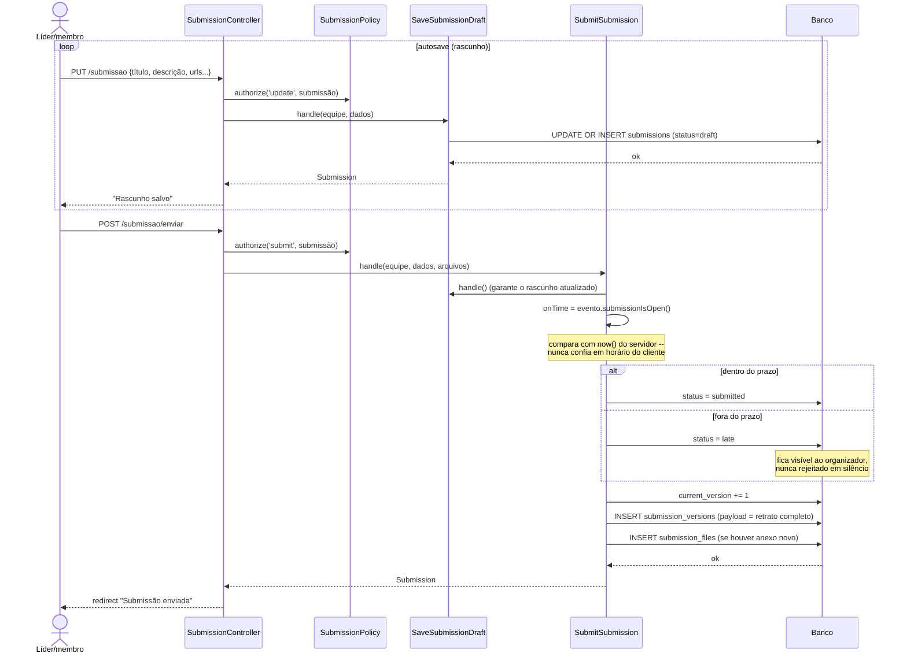
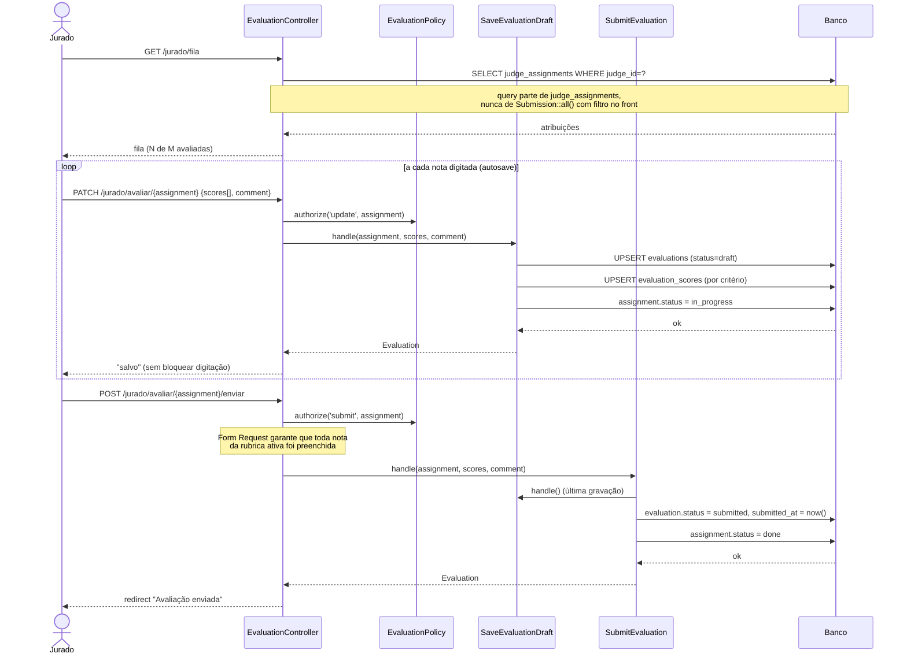
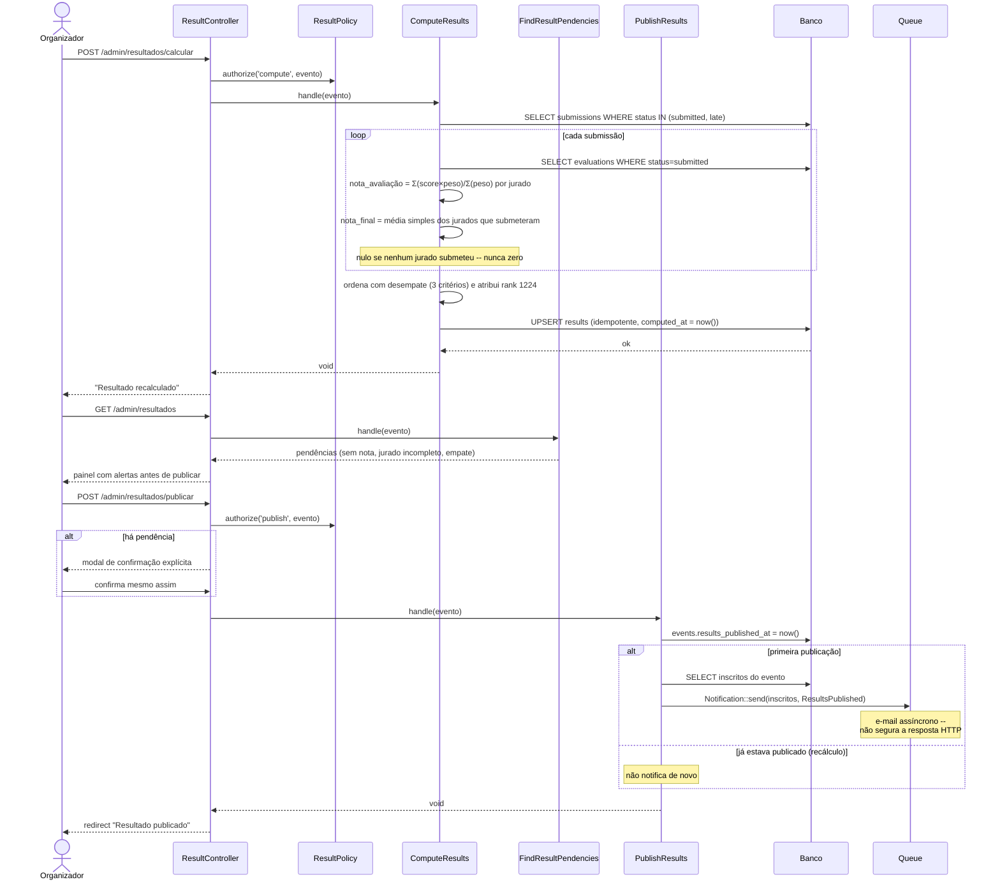

# Diagramas do sistema

Documentação técnica visual do Sistema de Apoio ao Hackathon IFPR. Fonte de
verdade extraída do código em `2026-08-20` (34 migrations, 23 models, 26
Actions) — não do `PLANO.md`, que descreve intenção; aqui é o que está
implementado e testado.

GitHub renderiza os blocos ```mermaid``` nativamente. Para editar, mude este
arquivo — não existe gerador automático, então depois de alterar `Model` ou
migration relevante, atualize o diagrama correspondente.

## Índice

1. [Diagrama de entidade-relacionamento](#1-diagrama-de-entidade-relacionamento)
2. [Diagrama de classes](#2-diagrama-de-classes)
3. [Diagrama de casos de uso](#3-diagrama-de-casos-de-uso)
4. [Diagramas de sequência](#4-diagramas-de-sequência)

---

## 1. Diagrama de entidade-relacionamento

Todas as tabelas de domínio (exclui `cache`, `jobs`, `sessions`,
`password_reset_tokens` e as tabelas do `spatie/laravel-permission`, que são
infraestrutura, não domínio). `users` carrega papéis via
`model_has_roles` (pacote spatie) — um usuário acumula papéis
(`participante`, `jurado`, `organizador`, `admin`), não é FK direta.

```mermaid
erDiagram
    USERS ||--o{ EVENT_REGISTRATIONS : "se inscreve"
    USERS ||--o{ TEAMS : "lidera (leader_id)"
    USERS ||--o{ TEAM_MEMBERS : "participa"
    USERS ||--o{ TEAM_INVITES : "convida (invited_by)"
    USERS ||--o{ SUBMISSIONS : "lança por (recorded_by)"
    USERS ||--o{ SUBMISSION_VERSIONS : "envia (created_by)"
    USERS ||--o{ SUBMISSION_FILES : "envia (uploaded_by)"
    USERS ||--o{ ATTENDANCES : "check-in (user_id)"
    USERS ||--o{ ATTENDANCES : "confirma (checked_by)"
    USERS ||--o{ JUDGE_ASSIGNMENTS : "avalia (judge_id)"
    USERS ||--o{ CONFLICTS_OF_INTEREST : "declara (judge_id)"
    USERS ||--o{ POPULAR_VOTES : "vota"
    USERS ||--o{ CERTIFICATES : "recebe"
    USERS ||--o{ INCIDENTS : "declara (declared_by)"

    EVENTS ||--o{ TRACKS : "tem"
    EVENTS ||--o{ EVENT_REGISTRATIONS : "recebe"
    EVENTS ||--o{ TEAMS : "tem"
    EVENTS ||--o{ TEAM_MEMBERS : "escopo"
    EVENTS ||--o{ TEAM_INVITES : "escopo"
    EVENTS ||--o{ SUBMISSIONS : "recebe"
    EVENTS ||--o{ SCHEDULE_ITEMS : "tem"
    EVENTS ||--o{ CHECKPOINTS : "tem"
    EVENTS ||--o{ RUBRICS : "tem"
    EVENTS ||--o{ JUDGE_ASSIGNMENTS : "escopo"
    EVENTS ||--o{ RESULTS : "materializa"
    EVENTS ||--o{ POPULAR_VOTES : "escopo"
    EVENTS ||--o{ CERTIFICATES : "emite"
    EVENTS ||--o{ INCIDENTS : "registra"

    TRACKS ||--o{ TEAMS : "agrupa"
    TRACKS ||--o{ SCHEDULE_ITEMS : "agrupa"

    TEAMS ||--o{ TEAM_MEMBERS : "tem"
    TEAMS ||--o{ TEAM_INVITES : "convida para"
    TEAMS ||--o| SUBMISSIONS : "envia (1 por equipe)"
    TEAMS ||--o{ CONFLICTS_OF_INTEREST : "referenciada em"

    SUBMISSIONS ||--o{ SUBMISSION_VERSIONS : "histórico"
    SUBMISSIONS ||--o{ SUBMISSION_FILES : "anexa"
    SUBMISSIONS ||--o{ JUDGE_ASSIGNMENTS : "recebe"
    SUBMISSIONS ||--o| RESULTS : "materializa em"
    SUBMISSIONS ||--o{ POPULAR_VOTES : "recebe"

    CHECKPOINTS ||--o{ ATTENDANCES : "registra"

    RUBRICS ||--o{ CRITERIA : "define"

    JUDGE_ASSIGNMENTS ||--o| EVALUATIONS : "produz"

    EVALUATIONS ||--o{ EVALUATION_SCORES : "detalha"
    CRITERIA ||--o{ EVALUATION_SCORES : "pontua"

    USERS {
        bigint id PK
        string name
        string email UK
        string google_id UK "nullable"
        string avatar_url "nullable"
        uuid qr_token UK
        string cpf UK "nullable, mod-11"
        string tipo_vinculo "nullable enum"
        string matricula_suap "nullable"
        string matricula_siape "nullable"
        timestamp deleted_at "soft delete"
    }

    EVENTS {
        bigint id PK
        string name
        string slug UK
        smallint edition
        string status "enum: draft..finished"
        timestamptz registration_opens_at
        timestamptz registration_closes_at
        timestamptz starts_at
        timestamptz ends_at
        timestamptz submission_deadline
        timestamptz voting_opens_at
        timestamptz voting_closes_at
        timestamptz results_published_at "nullable"
        tinyint min_team_size "default 2"
        tinyint max_team_size "default 5"
        int judges_per_submission
    }

    TRACKS {
        bigint id PK
        bigint event_id FK
        string name
        string color "nullable, hex"
    }

    EVENT_REGISTRATIONS {
        bigint id PK
        bigint event_id FK
        bigint user_id FK
        timestamp registered_at
        string shirt_size "nullable"
        string course "nullable"
    }

    TEAMS {
        bigint id PK
        bigint event_id FK
        bigint track_id FK "nullable"
        bigint leader_id FK
        string name
        string slug
        string invite_code UK "8 chars"
        string status "enum: draft/confirmed/disqualified"
        timestamptz confirmed_at "nullable"
        timestamp deleted_at "soft delete"
    }

    TEAM_MEMBERS {
        bigint id PK
        bigint event_id FK "denormalizado"
        bigint team_id FK
        bigint user_id FK
        string role "leader/member"
        string status "active/left"
        timestamp joined_at
        timestamp left_at "nullable"
    }

    TEAM_INVITES {
        bigint id PK
        bigint event_id FK
        bigint team_id FK
        string email
        string token UK "64 chars"
        bigint invited_by FK
        timestamp expires_at
        timestamp accepted_at "nullable"
    }

    SUBMISSIONS {
        bigint id PK
        bigint event_id FK
        bigint team_id FK "único (1 ativa)"
        string title "nullable"
        string status "draft/submitted/late/disqualified"
        timestamptz submitted_at "nullable"
        uint current_version "0 = rascunho"
        string source "web/email/papel/formulário"
        bigint recorded_by FK "nullable"
        timestamptz original_submitted_at "nullable, plano B"
        timestamp deleted_at "soft delete"
    }

    SUBMISSION_VERSIONS {
        bigint id PK
        bigint submission_id FK
        uint version
        jsonb payload "retrato imutável do envio"
        bigint created_by FK
    }

    SUBMISSION_FILES {
        bigint id PK
        bigint submission_id FK
        uint version
        string path "gerado pelo sistema"
        string original_name "metadado só"
        string mime
        bigint size
        bigint uploaded_by FK
        timestamp deleted_at "soft delete"
    }

    SCHEDULE_ITEMS {
        bigint id PK
        bigint event_id FK
        bigint track_id FK "nullable"
        string title
        string type
        timestamptz starts_at
        timestamptz ends_at
        bool is_published "default false"
    }

    CHECKPOINTS {
        bigint id PK
        bigint event_id FK
        string name
        string type
    }

    ATTENDANCES {
        bigint id PK
        bigint checkpoint_id FK
        bigint user_id FK
        timestamptz checked_in_at
        bigint checked_by FK "nullable, plano B"
        string method "qr/manual"
    }

    RUBRICS {
        bigint id PK
        bigint event_id FK
        string name
        bool is_active "só 1 ativa por evento"
    }

    CRITERIA {
        bigint id PK
        bigint rubric_id FK
        string name
        decimal weight "5,2"
        smallint max_score
        smallint position
    }

    JUDGE_ASSIGNMENTS {
        bigint id PK
        bigint event_id FK
        bigint judge_id FK
        bigint submission_id FK
        string status "pending/in_progress/done"
        timestamptz assigned_at
    }

    CONFLICTS_OF_INTEREST {
        bigint id PK
        bigint judge_id FK
        bigint team_id FK
        text reason "nullable"
    }

    EVALUATIONS {
        bigint id PK
        bigint assignment_id FK "UK, 1:1"
        string status "draft/submitted"
        text overall_comment "nullable"
        timestamp submitted_at "nullable"
    }

    EVALUATION_SCORES {
        bigint id PK
        bigint evaluation_id FK
        bigint criterion_id FK "restrict"
        decimal score "5,2, nullable"
        text comment "nullable"
    }

    RESULTS {
        bigint id PK
        bigint event_id FK
        bigint submission_id FK
        decimal final_score "5,2, nullable = sem nota"
        json criteria_breakdown
        uint rank_overall "nullable"
        uint rank_track "nullable"
        uint popular_votes_count "default 0"
        timestamptz computed_at
    }

    POPULAR_VOTES {
        bigint id PK
        bigint event_id FK
        bigint submission_id FK
        bigint user_id FK "único por evento"
    }

    CERTIFICATES {
        bigint id PK
        bigint event_id FK
        bigint user_id FK "restrict"
        string type
        uuid code UK
        json payload "nullable"
        string path "nullable até o job de PDF terminar"
        timestamptz issued_at
    }

    INCIDENTS {
        bigint id PK
        bigint event_id FK
        string kind
        timestamptz started_at
        timestamptz ended_at "nullable"
        uint deadline_extension_minutes "default 0, vale p/ todas as equipes"
        bigint declared_by FK
    }
```



**Invariantes de integridade que não aparecem no diagrama** (ver
`.claude/rules/database.md`):

- `restrictOnDelete()` em toda FK que aponta para um registro histórico
  (`recorded_by`, `created_by`, `uploaded_by`, `judge_id`, `checked_by`,
  `declared_by`, `certificates.user_id`, `evaluation_scores.criterion_id`) —
  apagar o usuário/critério não pode apagar a prova.
- Índices únicos parciais (não expressos em `erDiagram`): `submissions`
  (1 por equipe, `WHERE deleted_at IS NULL`), `team_members` (1 equipe ativa
  por pessoa por evento, `WHERE status = 'active'`), `team_invites` (1
  convite pendente por par equipe/e-mail, `WHERE accepted_at IS NULL`).
- `users.cpf`, `users.google_id`, `users.qr_token` são únicos globalmente;
  praticamente todo o resto (`teams.name`, `teams.slug`,
  `event_registrations`, `popular_votes`) é único **por evento**, não
  globalmente.

---

## 2. Diagrama de classes

### 2.1 Modelo de domínio (Eloquent)

Métodos mostrados são os que carregam regra de negócio (scopes, cálculo,
transição de estado) — omite acessores triviais e `casts()`.



### 2.2 Padrão arquitetural: Controller → Action → Model

Toda escrita com regra de negócio segue esta forma (ver
`.claude/rules/estrutura.md`); exemplo real com o fluxo de formar equipe.
Os outros 26 `Actions` seguem o mesmo formato — construtor sem dependência,
um método público `handle()`.



### 2.3 Inventário de Actions por domínio

| Domínio | Classes |
|---|---|
| `Auth` | (login/registro tratados pelo starter kit, sem Action dedicada) |
| `Certificates` | `IssueCertificate`, `IssueEventCertificates` |
| `Checkins` | `RegisterAttendance` |
| `Evaluation` | `SaveEvaluationDraft`, `SubmitEvaluation` |
| `Events` | `UploadRegulation` |
| `Incidents` | (registro direto no controller — Action não se justificou) |
| `Judging` | `DistributeJudges` |
| `Notifications` | `SendDeadlineReminders` |
| `Results` | `ComputeResults`, `PublishResults`, `FindResultPendencies` |
| `Submissions` | `SaveSubmissionDraft`, `SubmitSubmission` |
| `Teams` | `CreateTeam`, `JoinTeamByCode` |
| `Users` | `AnonymizeUser` |

---

## 3. Diagrama de casos de uso

Mermaid não tem um tipo nativo de diagrama de caso de uso UML; abaixo é uma
aproximação com `flowchart`, atores como nós de pessoa e casos de uso
agrupados por área do sistema. Papéis acumulam — o mesmo usuário pode ser
Participante **e** Jurado **e** Organizador ao mesmo tempo.

```mermaid
flowchart LR
    Visitante(("👤 Visitante"))
    Participante(("👤 Participante"))
    Lider(("👤 Líder de equipe"))
    Jurado(("👤 Jurado"))
    Organizador(("👤 Organizador"))
    Admin(("👤 Admin"))

    subgraph Publico["Público"]
        UC1["Ver evento, trilhas e agenda"]
        UC2["Ver política de privacidade"]
        UC3["Ver ranking (após publicação)"]
    end

    subgraph Conta["Conta"]
        UC4["Criar conta / entrar (Google ou e-mail)"]
        UC5["Editar perfil e identidade institucional"]
        UC6["Trocar foto de perfil"]
        UC7["Anonimizar / excluir conta"]
    end

    subgraph Inscricao["Inscrição e equipe"]
        UC8["Inscrever-se no evento"]
        UC9["Criar equipe"]
        UC10["Entrar em equipe por código de convite"]
        UC11["Convidar por e-mail"]
        UC12["Confirmar equipe"]
    end

    subgraph Submissao["Submissão"]
        UC13["Salvar rascunho de submissão"]
        UC14["Enviar submissão (com anexos)"]
        UC15["Ver histórico de versões"]
    end

    subgraph Evento["Dia do evento"]
        UC16["Check-in por QR code"]
        UC17["Votar (voto popular)"]
    end

    subgraph Avaliacao["Avaliação"]
        UC18["Ver fila de submissões atribuídas"]
        UC19["Avaliar (autosave de rascunho)"]
        UC20["Enviar avaliação"]
    end

    subgraph Organizacao["Organização"]
        UC21["Publicar/editar agenda"]
        UC22["Distribuir jurados"]
        UC23["Registrar conflito de interesse"]
        UC24["Fazer check-in manual (plano B)"]
        UC25["Lançar submissão por fora (plano B)"]
        UC26["Registrar incidente / estender prazo"]
        UC27["Calcular resultado"]
        UC28["Publicar resultado"]
        UC29["Emitir certificados"]
        UC30["Ver auditoria (activity log)"]
    end

    Visitante --> UC1
    Visitante --> UC2
    Visitante --> UC3
    Visitante --> UC4

    Participante --> UC5
    Participante --> UC6
    Participante --> UC7
    Participante --> UC8
    Participante --> UC9
    Participante --> UC10
    Participante --> UC13
    Participante --> UC14
    Participante --> UC15
    Participante --> UC16
    Participante --> UC17

    Lider --> UC9
    Lider --> UC11
    Lider --> UC12

    Jurado --> UC18
    Jurado --> UC19
    Jurado --> UC20

    Organizador --> UC21
    Organizador --> UC22
    Organizador --> UC23
    Organizador --> UC24
    Organizador --> UC25
    Organizador --> UC26
    Organizador --> UC27
    Organizador --> UC28
    Organizador --> UC29
    Organizador --> UC30

    Admin --> Organizacao
```



---

## 4. Diagramas de sequência

Os cinco fluxos-fim-a-fim do sistema, na ordem em que uma equipe
efetivamente passa por eles: inscrição → formar equipe → submissão →
avaliação → resultado.

### 4.1 Inscrição no evento



### 4.2 Formar equipe

Dois caminhos possíveis: criar uma equipe nova (o criador vira líder) ou
entrar em uma existente pelo código de convite. `JoinTeamByCode` usa
`lockForUpdate()` para fechar uma corrida real — duas pessoas usando o
mesmo código no mesmo instante não podem ambas passar a checagem de "equipe
cheia" e estourar `max_team_size`.



### 4.3 Enviar submissão

`SaveSubmissionDraft` roda a cada autosave e nunca cria uma `SubmissionVersion`
— versão é retrato de envio, não de rascunho. `SubmitSubmission` decide
`submitted` vs. `late` comparando com `now()` no servidor, nunca com o relógio
do navegador.



### 4.4 Avaliar submissão

Pré-condição: o organizador já rodou `DistributeJudges`, então o jurado tem
`judge_assignments` pendentes. Conflito de interesse bloqueia a atribuição
antes deste fluxo começar — nunca aparece na fila do jurado.



### 4.5 Calcular e publicar resultado

`ComputeResults` é idempotente e nunca publica sozinho — publicar é ato manual
do organizador, checado por `results_published_at`. `PublishResults` só
notifica na transição draft→publicado, para reclicar "publicar" depois de um
recálculo não spammar os inscritos de novo.


